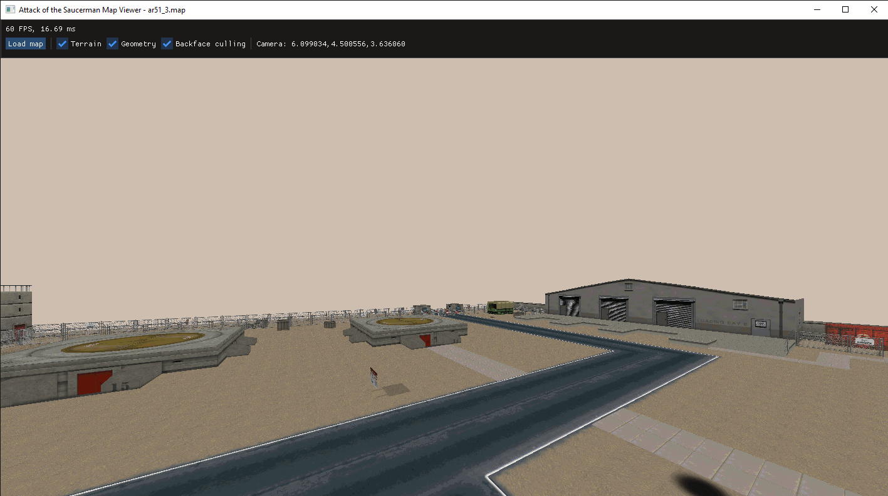
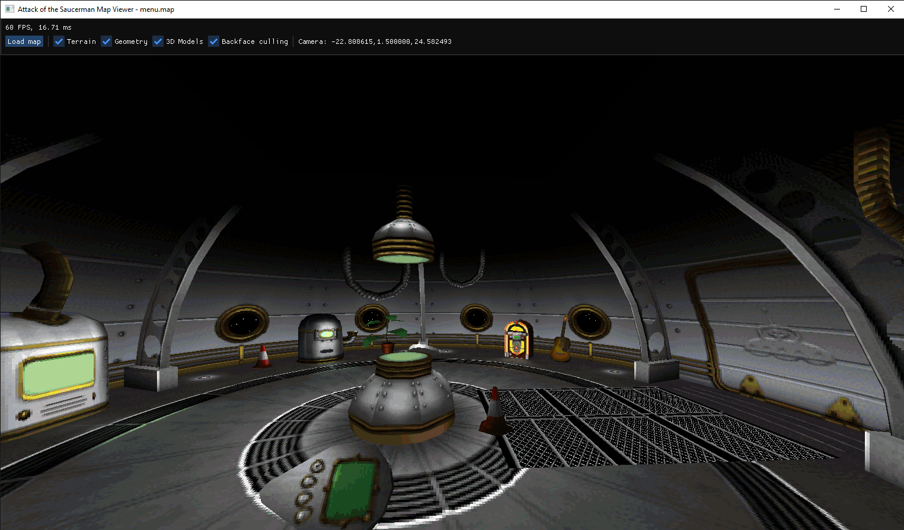

# Map viewer and asset exporter for Attack of the Saucerman

I'm working on reverse engineering the file formats of the 1999 game [Attack of the Saucerman](https://en.wikipedia.org/wiki/Attack_of_the_Saucerman) (Windows version). This repository contains the results of this work so far:

* [Map viewer](#map-viewer)
* [Asset exporter](#asset-exporter)
* [File format specifications](/file_format_specs.md)

All of this is work in progress and not complete yet.

 


## Map viewer

The map viewer is written in C++, and uses SDL+OpenGL. It's currently fairly basic: It can open and display all of the game's level files, but it can't display all elements of a map yet, and only offers very basic camera movement.

Use the up/down arrow keys to move forwards/backwards, and left/right to turn. Holding shift + arrow up/down allows moving up and down vertically.

### What works

* Displaying terrain, level geometry, and 3D models
* Basic tank-control style camera movement
* Toggling display of different elements

### What's missing

* Displaying billboard sprites
* Texture animations
* Handling translucent surfaces
* Lighting (texture brightness adjustments)
* Displaying entities and other map elements
* More flexible camera movement (looking up/down, mouse look?)

### How to run it

Building the map viewer requires CMake, SDL2, and a C++-17 capable compiler.
On Windows, the SDL dependency can be installed using vcpkg, on Linux/Mac it's available via the usual package managers.
The build process is standard CMake fare. For example (using the Ninja build tool):

```bash
mkdir build
cd build
cmake .. -GNinja
ninja
```

The resulting binary, `bin/SaucerMapViewer`, accepts the path to a map file as command line argument. On Windows, you can also drag a map file onto the executable to launch it.


## Asset exporter

The asset exporter is a Python script. It reads files in the game's `wad` format (unrelated to Doom WADs), and currently unpacks the following assets:

* Textures and other images (converted to PNG files)
* 3D models (converted to glTF files)
* Sound effects (exported as WAVE files)

The exported 3D models currently don't support translucent surfaces, and aren't the most efficient representation.

The script requires Python 3 and the [Pillow](https://python-pillow.org/) library, which can be installed using PIP (`pip install Pillow`).

To use the script, first unpack the game's main data container `Saucerdata.pak`. This is basically just a ZIP file, and most standard tools should be able to extract it (I had trouble using 7zip, but Linux `unzip` and Windows Explorer's built-in ZIP support worked fine).
After that, invoke the script on the desired WAD file by passing its path as a command-line argument.
The dumped files are placed into a new directory called `<wad_file_name>_exported`.

For example, to unpack the first level's assets:

```bash
unzip Saucerdata.pak
python3 dump_wad_file.py LEVELS/ar51_1.wad
```

